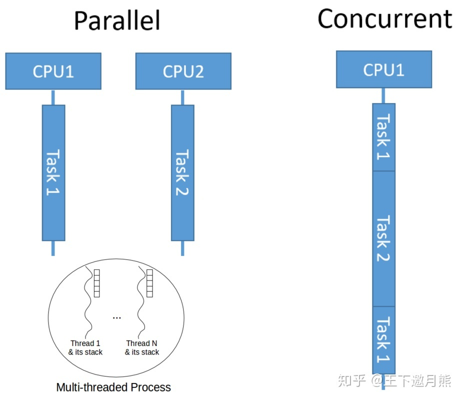
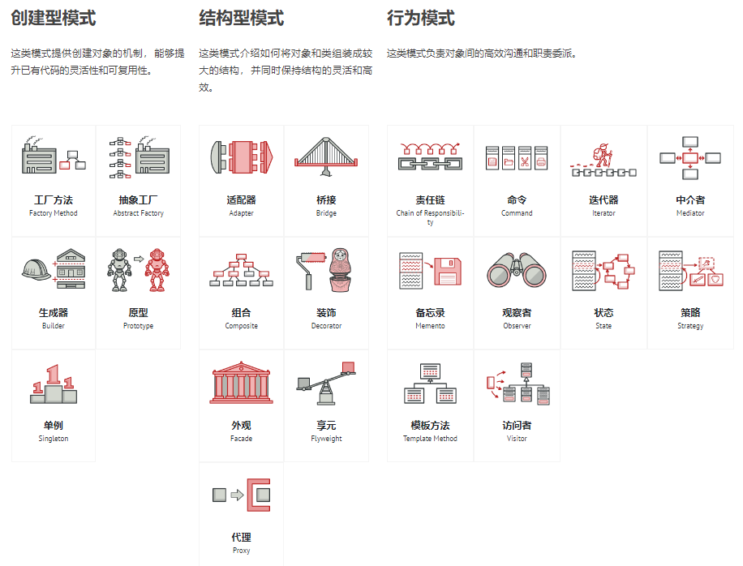
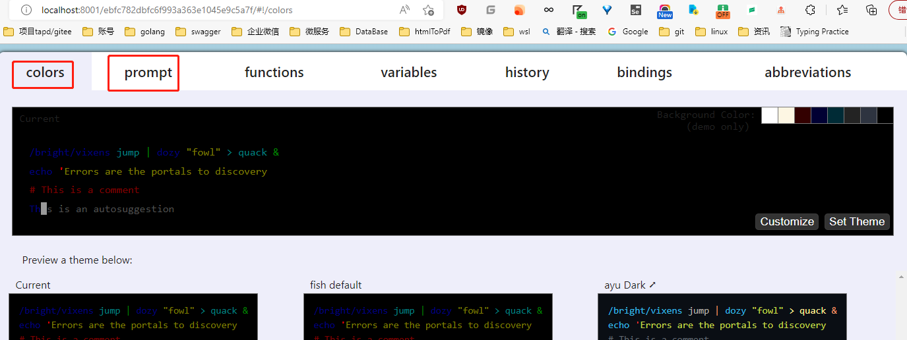
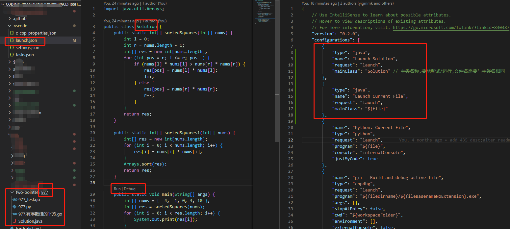

# coding practicing

- [coding practicing](#coding-practicing)
  - [concurrency(并发) and parallellism(并行)](#concurrency并发-and-parallellism并行)
    - [基本同步原语](#基本同步原语)
    - [分布式同步原语](#分布式同步原语)
    - [参考](#参考)
  - [distribution](#distribution)
    - [paper](#paper)
      - [共识算法](#共识算法)
  - [design patterns](#design-patterns)
    - [references](#references)
  - [algorithm and datastructure](#algorithm-and-datastructure)
    - [algorithm](#algorithm)
    - [datastructure](#datastructure)
  - [awesome xxx and mark](#awesome-xxx-and-mark)
    - [collection](#collection)
    - [database](#database)
      - [JSON](#json)
        - [JSON Array](#json-array)
        - [JSON Object](#json-object)
      - [sql优化](#sql优化)
      - [博文](#博文)
    - [blog](#blog)
    - [notes](#notes)
    - [linux](#linux)
    - [language](#language)
      - [python](#python)
      - [go](#go)
        - [profile](#profile)
        - [Time](#time)
        - [unsafe](#unsafe)
        - [reflect](#reflect)
        - [got-raps](#got-raps)
        - [go-tool](#go-tool)
      - [测试](#测试)
      - [interface/接口](#interface接口)
      - [repo and tool](#repo-and-tool)
      - [log](#log)
  - [leetcode](#leetcode)
    - [常见题型](#常见题型)
    - [技巧](#技巧)
      - [向上取证,ceil](#向上取证ceil)
    - [c++](#c)
      - [依赖](#依赖)
      - [编译/Compile](#编译compile)
    - [golang](#golang)
      - [lint](#lint)
    - [py](#py)
      - [issue](#issue)
        - [2022-10-10,在contos和ubuntu18.04上默认安装的python3.6.9调试python代码断点不能触发](#2022-10-10在contos和ubuntu1804上默认安装的python369调试python代码断点不能触发)
      - [fish 部分v2的版本支持conda](#fish-部分v2的版本支持conda)
    - [java](#java)
      - [环境](#环境)
      - [issues](#issues)
        - [Program Error: Could not find or load main class x](#program-error-could-not-find-or-load-main-class-x)
  - [blogs](#blogs)
  - [tool](#tool)
  - [统计](#统计)

## concurrency(并发) and parallellism(并行)

并发就是可同时发起执行的程序，指**程序的逻辑结构**;
并行就是可以在支持并行的硬件上执行的并发程序，指程序的运⾏状态。

换句话说，并发程序代表了所有可以实现并发行为的程序，这是一个比较宽泛的概念，并行程序也只是他的一个子集。
并发是并⾏的必要条件；但并发不是并⾏的充分条件。
并发只是更符合现实问题本质的表达，目的是简化代码逻辑，⽽不是使程序运⾏更快。
要使程序运⾏更快必是并发程序加多核并⾏。

简言之，并发是同一时间应对（dealing with）多件事情的能力；并行是同一时间动手做（doing）多件事情的能力。



### 基本同步原语

### 分布式同步原语

### 参考

- [ppt:Go并发编程](./static/ppt/Go%E5%B9%B6%E5%8F%91%E7%BC%96%E7%A8%8B.pptx)
- [repo:深入go并发编程](https://github.com/smallnest/dive-to-gosync-workshop)
- [post:并发编程导论](https://zhuanlan.zhihu.com/p/63309292)
- [深入理解计算机系统]

## distribution

### paper

#### 共识算法

共识是可容错系统中的一个基本问题：即使面对故障，服务器如何在共享状态上达成一致?
这个问题出现在需要提供高可用性且不能在一致性上妥协的各种系统中

- [raft,中文翻译](https://github.com/OneSizeFitsQuorum/raft-thesis-zh_cn/blob/master/raft-thesis-zh_cn.md)
  Paxos共识算法复杂且难以理解.在设计Raft时,作者通过分解(Raft分离了领导者选举,日志复制,和安全性)和
  状态空间缩减(Raft减少了不确定程度和服务器彼此之间不一致的方式)提高可理解性.
  节点状态: 领导者,跟随者,候选人.
- [raft,in English](https://raft.github.io/raft.pdf)
  
## design patterns



### references

- [refactoringguru.cn](https://refactoringguru.cn/design-patterns/abstract-factory)
- [博文,设计模式](https://lailin.xyz/post/factory.html)
- [博文,刘丹冰aceld,设计模式](https://www.yuque.com/aceld/lfhu8y/pebesh)
- [repo:go-patterns](https://github.com/tmrts/go-patterns)

## algorithm and datastructure

### algorithm

sort/search/bitmap

### datastructure

tree/list/array

## awesome xxx and mark

### collection

1. [awesome-go-cn,Go框架、库和软件的中文收录大全](https://github.com/yinggaozhen/awesome-go-cn)
2. [开发者头条,博客/公众号各种站点资讯,提供订阅服务](https://toutiao.io/posts/hot/30)
3. [架构师](https://github.com/xingshaocheng/architect-awesome)
4. [github 资讯](https://github.com/GitHubDaily/GitHubDaily)
5. [repo: algorithm & data structure](https://github.com/KeKe-Li/data-structures-questions)
6. [repo: it资料大全](https://github.com/0voice)
7. [repo: k8s-tutorials](https://github.com/guangzhengli/k8s-tutorials)
8. [bytebytego: system design interview](https://bytebytego.com/courses/system-design-interview/scale-from-zero-to-millions-of-users)
9. [bytebytego: Newsletter](https://blog.bytebytego.com/)

### database

- [mysql 8.0 document](https://dev.mysql.com/doc/refman/8.0/en/preface.html)
- [repo: TiDB Talent-Plan,分布式数据库,分布式系统](https://github.com/pingcap/talent-plan)
- [极客时间 丁奇 Mysql45讲](https://time.geekbang.org/column/intro/100020801)
- [SQL 审核查询平台](https://github.com/hhyo/Archery)
- [mysql 日期相关函数](https://blog.csdn.net/hu1010037197/article/details/115391335)
- [知乎专栏,mysql 优化](https://www.zhihu.com/column/c_1439702957097447424)
- [TiDB技术月刊](https://tidb.net/book/tidb-monthly/2022-09/)
- [repo: 电子科技大学,分布式存储](<https://github.com/CDDSCLab/training-plan>)
- [sql for devs,许多sql可以实现的feature和sql优化建议](https://sqlfordevs.com/)
  - 可以在RDB里使用JSON字段存储复杂的数据结构,同时兼顾安全性和规范
    - [json-validation,解读,测试](./sql/json-validation/README.md)
    - [json字段校验](https://sqlfordevs.com/json-schema-validation)
    - [mysql doc](https://dev.mysql.com/doc/refman/8.0/en/json-validation-functions.html#function_json-schema-valid)

#### JSON

mysql的JSON总体上分为JOSN_ARRAY 和 JSON Object两块

参考:

- [mysql json api](https://www.sjkjc.com/mysql-ref/json_length/)

##### JSON Array

[API](./sql/json/README.md)

- 数组长度,JSON_LENGTH
- 值搜索,JSON_SEARCH

##### JSON Object

#### sql优化

- [字节,慢SQL分析与优化](https://mp.weixin.qq.com/s?__biz=MzI1MzYzMjE0MQ==&mid=2247496603&idx=1&sn=d1b2e6639850ea4c211fd8eb322d9fa7&chksm=e9d33879dea4b16f81f676fc9c96159f994c6b8d4dbf3b07d83ee6fb4d3f671512edd40db671&mpshare=1&scene=1&srcid=1130sOFNEWMhuTPoSrqpxWtt&sharer_sharetime=1669772107552&sharer_shareid=4e8d99f0a3202ef91dff0cc802f24f2d&version=4.0.12.6015&platform=win#rd)
  [分析了影响sql执行的主要因素,介绍基本的优化思路和案例](./sql/optimize/long_query.md)

#### 博文

- [LeetCode题解 mysql 查询策略,窗口函数,排序](https://leetcode.cn/problems/nth-highest-salary/solution/mysql-zi-ding-yi-bian-liang-by-luanz/)
- [mysql 窗口函数(Window Function),文档](https://dev.mysql.com/doc/refman/8.0/en/window-function-descriptions.html)
- [MySQL TIME_WAIT连接,2MSL](https://blog.csdn.net/fkew2009/article/details/86714699)
- [too many connections](https://kalacloud.com/blog/mysql-error-too-many-connections)
  优化方案(确认不是由于没有关闭连接导致的后),通过合理设置参数(减少Sleep的连接,防止大量Sleep的连接占满)
  
  - [interactive_timeout](https://dev.mysql.com/doc/refman/5.7/en/server-system-variables.html#sysvar_interactive_timeout)
    The number of seconds the server waits for activity on an interactive connection before closing it. An interactive client is defined as a client that uses the CLIENT_INTERACTIVE option to mysql_real_connect().
  - [wait_timeout](https://dev.mysql.com/doc/refman/5.7/en/server-system-variables.html#sysvar_wait_timeout)
    The number of seconds the server waits for activity on a noninteractive connection before closing it.
  - [max_connections：控制最大连接数](https://dev.mysql.com/doc/refman/5.7/en/server-system-variables.html#sysvar_max_connections)
  - [max_user_connections：控制单个用户的最大连接数](https://dev.mysql.com/doc/refman/5.7/en/server-system-variables.html#sysvar_max_user_connections)
  - [gorm,database/sql连接池,参数设置](https://gorm.io/docs/connecting_to_the_database.html#Connection-Pool)
    - SetMaxOpenConns(_dbMaxOpenConns) 最大连接数
    - SetMaxIdleConns(_dbMaxIdleConns) 最大空闲连接数
    - SetConnMaxLifetime(_dbMaxLifeTime) 最大生命周期
    - SetConnMaxIdleTime(_dbMaxIdleTime) 最大空闲时间

### blog

1. [小林coding](https://xiaolincoding.com/)
2. [潘少,ants 作者,go contributor](https://strikefreedom.top/)

### notes

- [笔记,汇总 programnotes.cn](https://programnotes.cn/a-set-of-notes-blogs/index.html)
- 正则表达式
- [LSM-tree](https://blog.fatedier.com/2016/06/15/learn-lsm-tree/)
- [git,分支模式,阿里云codeup](https://help.aliyun.com/document_detail/202380.html)

### linux

- [shell配置,bashrc,profile](https://zhuanlan.zhihu.com/p/405174594)
- [shell代码含义,explain shell online](https://explainshell.com/)

### language

#### python

- [doc](https://docs.python.org/zh-cn/3.10/tutorial/index.html)

#### go

- [effective go](https://golang.google.cn/doc/effective_go.html)
- [go code review](https://github.com/golang/go/wiki/CodeReviewComments#gofmt)
- [go basic,Golang基础框架图](image/go/Golang基础框架图.png)
- [repo: gostl,implement datastructure and algorithm with go](https://github.com/liyue201/gostl)
- [goroutine pool,限制goroutine数量](https://github.com/panjf2000/ants)
- [go 零拷贝,pipe pool,原理:系统调用splice+pipe,其他实现:HAProxy](https://strikefreedom.top/archives/pipe-pool-for-splice-in-go)

##### profile

profile通常分为:追踪型(追踪提前设定的事件,如函数调用,含税退出)/采样型

go支持的profile有:cpu/memory/block/goroutine

go的cpu profile在Linux系统使用信号中断(SIGPROF signal)采集运行数据.
>SIGPROF signal: This signal typically indicates expiration of a timer that measures both CPU time used by the current process, and CPU time expended on behalf of the process by the system. Such a timer is used to implement code profiling facilities, hence the name of this signal.
go通过SIGPROF注册回调函数每10ms采集一次.
**需要注意的是:统计时间与用户体验到的时间通常不同**,[profile notes](https://github.com/DataDog/go-profiler-notes/blob/main/guide/README.md),例如一次http请求耗时100ms(数据库耗时95ms,cpu5ms)

memory profile同样基于采样生成

- [go doc,profile&trace](h)
- [profiling go programs](https://golang.google.cn/blog/pprof)
- [profile](https://mp.weixin.qq.com/s/DRQWcU2dN-FycoyFZfnklA) go profile原理
- [Go Profiler Internals](https://www.instana.com/blog/go-profiler-internals/)
- [repo go-profiler-notes](https://github.com/DataDog/go-profiler-notes) go profile

##### Time

[Time](./base/time/README.md)

##### unsafe

[unsafe](./base/unsafe/README.md)

##### reflect

[reflect](./base/reflect/README.md)

##### got-raps

[traps](./base/go-traps/gotraps.md)

##### go-tool

- [go-tool:build](./base/go-tool/build.md)
- [go-tool:build](./base/build/README.md)
- [go-tool:list](./base/go-tool/list.md)
- [go-tool:get](./base/go-tool/get.md)
- [go-tool:install](./base/go-tool/install.md)

#### 测试

[go测试之道](./base/tests/README.md)

#### interface/接口

[interface](./base/interface/README.md)

#### repo and tool

- [apisix](https://apisix.apache.org/zh/blog/2021/05/24/tencent-games/)
- [Introduction-to-Golang](https://github.com/0voice/Introduction-to-Golang)
- [repo:用go写脚本](https://github.com/bitfield/script)
- [repo:learn go by example](https://github.com/gobyexample-cn/gobyexample)

#### log

日志是程序的重要组成部分,好的日志能帮助我们快速排查/定位/解决问题,记录现场信息

一个好的Logger应该提供以下能力:

- 支持把日志写入到多个输出流中，比如可以选择性的让测试、开发环境同时向控制台和日志文件输出日志，生产环境只输出到文件中。
- 支持多级别的日志等级，比如常见的有：TRACE，DEBUG，INFO，WARN，ERROR 等。
- 支持结构化输出，结构化输出现在常用的就是JSON形式的，这样可以统一日志平台，通过 logstash 之类的组件直接把日志聚合到日志平台上去。
- 需要支持日志切割 -- log rotation， 按照日期、时间间隔或者文件大小对日志进行切割。
- 在 Log Entry 中（就是每行记录）除了主动记录的信息外，还要包括如打印日志的函数、所在的文件、行号、记录时间等。

[log](./log/README.md)

## leetcode

### 常见题型

[常见题型,来源,知乎:https://zhuanlan.zhihu.com/p/349940945](./go/to-do-list.md)

### 技巧

#### 向上取证,ceil

ceil(a/b)=(a+b-1)/b=(a-1)/b+1

当a/b能除尽,那么(a-1)/b除不尽取整+1后是向上取证的值
当a/b能除不尽,那么(a-1)/b除不尽取整+1后是向上取证的值

### c++

#### 依赖

gcc,g++,gdb,vscode

#### 编译/Compile

- VScode

  clone代码仓库

  ```shell
  git clone git@github.com:yiGmMk/leetcode.git
  ```

  在Vscode打开代码目录，选择文件->打开文件夹,选中代码目录

- vscode 安装依赖插件

  c++建议安装 twxs.cmake + austin.code-gnu-global+visualstudioexptteam.vscodeintellicode

- 点击对应的cpp源文件F5开始调试

### golang

#### lint

- 使用github action + golangci-lint
- lint配置文件: .golangci.yml

### py

#### issue

##### 2022-10-10,在contos和ubuntu18.04上默认安装的python3.6.9调试python代码断点不能触发

1. vscode版本
  Version: 1.72.0 (user setup)
  Commit: 64bbfbf67ada9953918d72e1df2f4d8e537d340e
  Date: 2022-10-04T23:20:39.912Z
  Electron: 19.0.17
  Chromium: 102.0.5005.167
  Node.js: 16.14.2
  V8: 10.2.154.15-electron.0
  OS: Windows_NT x64 10.0.19044
  Sandboxed: No

2. 升级python版本到3.9.12就好了,这里使用conda安装方便切换
   - 清华镜像 <https://mirrors.tuna.tsinghua.edu.cn/help/anaconda/>
   - miniconda <https://docs.conda.io/en/latest/miniconda.html>
   - linux下载的都是脚本通过脚本安装

#### fish 部分v2的版本支持conda

1. fish version(contos v2.3.1)
2. 报错: Variables may not be used as commands. In fish, please define a function or use 'eval $CONDA_EXE'.
3. 解决: 将v2的fish卸载,重新安装v3版本,再初始化conda的fish配置

   ```sh
   # 卸载(contos)
   yum erase fish

   # 安装
   cd /etc/yum.repos.d/
   wget https://download.opensuse.org/repositories/shells:fish:release:3/CentOS_7/shells:fish:release:3.repo
   yum install fish
   
   # 配置初始化
   conda init fish

   # 进入fish
   fish

   # 尝试使用
   conda -h

   # ubuntu 安装fish v3
   sudo apt-add-repository ppa:fish-shell/release-3
   sudo apt update
   sudo apt install fish
   ```

4. 参考 <https://github.com/conda/conda/issues/11079>
5. fish配置,输入fish_config,会弹出web页面,可视化配置
  

### java

#### 环境

vscode + 插件 (Extension Pack for Java,多个插件集合)

#### issues

##### Program Error: Could not find or load main class x

可能是launch.josn中的主类名称错误或者文件不再classpath
主要检测以下几项:

- Check whether the class name specified in mainClass exists and is in the right form.
- Run VS Code command "Java: List all Java source paths" to show all source paths recognized by the workspace.
- Check the Java file you are running is under any source path? If not, go to File Explorer, right click the folder containing your Java file, and run the menu "Add Folder to Java Source Path" to mark the containing folder as a Java source root.
- Run VS Code command "Java: Force Java compilation" to rebuild your workspace.
- If the problem persists, it's probably because the language server doesn't load your project correctly. Please reference the language server troubleshooting paragraph for more troubleshooting info.

首先确认下java源文件是否在"Java source paths",不在可以右击所在目录选择"Add Folder to Java Source Path"添加
然后确认源文件文件名称是否与主类名称一致.
点击Run或Debug Vscode会自动在.vscode/launch.json中添加配置,如图



参考:

- [vscode java常见问题,troubleshooting guide](https://github.com/microsoft/vscode-java-debug/blob/main/Troubleshooting.md)
- [vscode java常见问题](https://code.visualstudio.com/docs/java/java-debugging)

## blogs

- [io-is-no-longer-the-bottleneck](https://benhoyt.com/writings/io-is-no-longer-the-bottleneck/)
  当今,SSD和机械磁盘的顺序读写速度已经很快了,在顺序读写的场景下,磁盘io不再是程序的瓶颈,作者以一个计算单词数的程序为例使用go和python测试对比了性能数据
- [nginx 中文文档](https://blog.redis.com.cn/doc/standard/httprewrite.html)
- [nginx location,root,alias](http://t.csdn.cn/J3npY)
  [nginx](./cloud-native/nginx/README.md)
  
## tool

- book <https://libgen.gs/>
  - [镜像](https://www.ooopn.com/tool/libgen/)
- [repo zlib/libgen index](https://github.com/zlib-searcher/zlib-searcher)
  - [demo](https://zlib.knat.network/)
- [IFPS repo,官方](https://github.com/ipfs/public-gateway-checker)
  - [IPFS 下载](https://ipfs-public-gateway-checker.on.fleek.co/)
  - [IPFS 下载](https://ipfs-checker.1kbtool.com/)
  - [教程,在ipfs服务后添加ipfs cid即可下载](https://1kbtool.com/web/ipfs-checker/)
- neat-read,convert(支持azw3,epub,pdf等) <https://www.neat-reader.cn/webapp#/>

## 统计

[](https://goproxy.cn)
