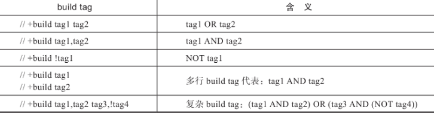

# go build

- [go build](#go-build)
  - [流程](#流程)
  - [-x:print the commands](#-xprint-the-commands)
  - [-v:print the names of packages as they are compiled](#-vprint-the-names-of-packages-as-they-are-compiled)
  - [-a 强制重新构建所有包](#-a-强制重新构建所有包)
  - [-race 加入竞检测代码](#-race-加入竞检测代码)
  - [-gcflags 传给编译器的标志选项](#-gcflags-传给编译器的标志选项)
  - [-ldflags 传给链接器的标志选项集合](#-ldflags-传给链接器的标志选项集合)

## 流程

- 创建用于构建的临时目录
- 下载构建module s依赖的module t和u
- 分别编译module t和u，将编译后的结果存储到临时目录及GOCACHE目录下
- 编译module s
- 定位和汇总module s的各个依赖包构建后的目标文件（.a文件）的位置，形成importcfg.link文件，供后续链接器使用
- 链接成可执行文件
- 清理临时构建环境。

## -x:print the commands

## -v:print the names of packages as they are compiled

输出被编译的包名

## -a 强制重新构建所有包

go build -a的工作原理使得它在传统的gopath模式下会更有意义，因为它可以绕过缓存和已经安装到$GOPATH/pkg下的依赖包库文件（.a），直接将各个依赖包在本地的最新变化反映到重新构建的成果中。

在module-aware模式下go build -a和go build构建出的结果一般都是一致的，这也导致在该模式下go build -a变得很少用

## -race 加入竞检测代码

会在构建的结果中加入竞态检测的代码。在程序运行过程中，如果发现对数据的并发竞态访问，这些代码会给出警告，这些警告信息可以用来辅助后续查找和解决竞态问题

## -gcflags 传给编译器的标志选项

```sh
go build -gcflags='-N -l'      // 仅将传递的编译选项应用于当前包
go build -gcflags=all='-N -l'  // 将传递的编译选项应用于当前包及其所有依赖包
go build -gcflags=std='-N -l'  // 仅将传递的编译选项应用于标准库包
```

使用

```sh
go tool compile -help
```

查看支持的选项.

常用的选项:

- -l：关闭内联(disable inlining)
- -N：关闭代码优化(disable optimizations)
- -m：输出逃逸分析（决定哪些对象在栈上分配，哪些对象在堆上分配）的分析决策过程
- -S：输出汇编代码。
- -L:also show actual source file names in error messages for positions affected by //line directives
  
在运行调试器对程序进行调试之前,我们通常使用“-N -l”两个选项关闭对代码的内联和优化，这样能得到更多的调试信息。

## -ldflags 传给链接器的标志选项集合

```sh
go tool link -help
```

常用选项

- -X 设置指定包中string变量的值.
  
  ```go
   var (
       version string
   )
   
   func main() {
       if os.Args[1] == "version" {
           fmt.Println("version:", version)
           return
       }
   }
   // go build -ldflags "-X main.version=v0.7.0" xxx.go
  ```

- -s:不生成符号表(symbol table)
- -w:不生成DWARF(Debugging With Attributed Record Formats)调试信息(disable DWARF generation)
  默认情况下，go build构建出的可执行二进制文件中都是包含符号表和DWARF格式的调试信息的，
  这虽然让最终二进制文件的体积增加了，但是符号表和调试信息对于生产环境下程序异常时的现场保存和在线调试都有着重要意义
- -tags:指定构建约束条件
  [build,tags](../build/README.md)
  
