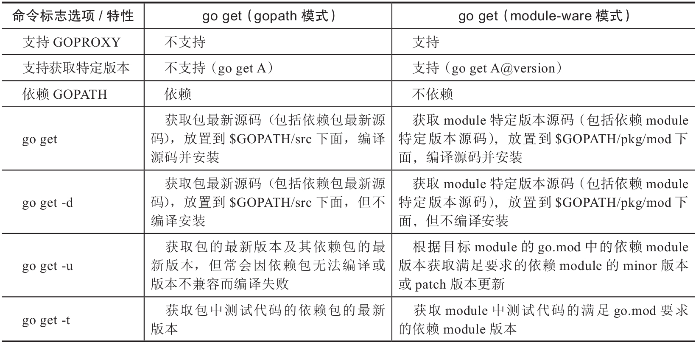

# go get

将Go包及依赖下载到本地,并编译安装目标包

- gopath模式下，如果目标源码最终被编译为一个可执行二进制文件，则该文件将被安装到$GOBIN或$GOPATH/bin下
- 在module-aware模式下
  编译出的可执行二进制文件也会被安装到$GOBIN或$GOPATH/bin下
  如果目标源码是库，则只编译并将编译结果缓存下来（Linux系统下缓存默认在~/.cache/go-build下），而不安装。



## -d,仅获取源码

```sh
go get -d github.com/pkg/errors
```

## -u 更新依赖版本

在gopath模式下，执行go get -u是有风险的：由于没有版本的概念，go get -u只是单纯地下载包的最新版本

## -t 获取测试代码依赖的包

通常与-d或-u组合使用，用来指示go get在仅下载源码或构建安装时要考虑测试代码的依赖，将测试代码的依赖包一并获取
