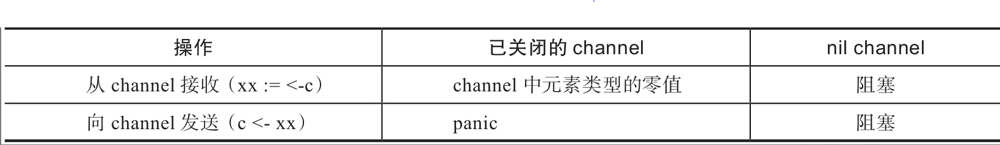

# go traps

- [go traps](#go-traps)
  - [interface](#interface)
  - [for range](#for-range)
    - [在“复制品”上进行迭代](#在复制品上进行迭代)
    - [迭代变量重用](#迭代变量重用)
    - [string类型的for range不是逐字节迭代](#string类型的for-range不是逐字节迭代)
  - [切片/slicce](#切片slicce)
    - [对内存的过多占用](#对内存的过多占用)
    - [隐匿数据暴露和切片数据篡改](#隐匿数据暴露和切片数据篡改)
    - [切片与原切片底层存储可能会“分家](#切片与原切片底层存储可能会分家)
  - [json](#json)
  - [net](#net)
    - [客户端,http包需要我们手动关闭Response.Body](#客户端http包需要我们手动关闭responsebody)
    - [HTTP客户端默认不会及时关闭已经用完的HTTP连接](#http客户端默认不会及时关闭已经用完的http连接)
  - [string](#string)
    - [string长度不等于字符个数](#string长度不等于字符个数)
  - [goroutine](#goroutine)
    - [无法得到goroutine退出状态](#无法得到goroutine退出状态)
    - [任何一个goroutine出现panic，如果没有及时捕获，那么整个程序都将退出](#任何一个goroutine出现panic如果没有及时捕获那么整个程序都将退出)
  - [channel](#channel)
  - [方法](#方法)
  - [break](#break)

## interface

[interface](../interface/README.md)

## for range

### 在“复制品”上进行迭代

```go
func main() {
    var a = []int{1, 2, 3, 4, 5}
    var r = make([]int, 0)
    fmt.Println("a = ", a)

    for i, v := range a {
        if i == 0 {
            a = append(a, 6, 7)
        }
        r = append(r, v)
    }
    fmt.Println("r = ", r)
    fmt.Println("a = ", a)
}

// a =  [1 2 3 4 5]
// r =  [1 2 3 4 5]
// a =  [1 2 3 4 5 6 7]
```

range表达式中的a实际上是原切片a的副本（暂称为a'），在该表达式初始化后，副本切片a'内部表示中的len字段就是5，并且在整个for range循环过程中并未改变，因此for range只会循环5次

### 迭代变量重用

在for i, v := range xxx这条语句中，i、v都被称为迭代变量

```go
func main() {
    var a = []int{1, 2, 3, 4, 5}
    var wg sync.WaitGroup

    for _, v := range a {
        wg.Add(1)
        go func() {
            time.Sleep(time.Second)
            fmt.Println(v)
            wg.Done()
        }()
    }
    wg.Wait()
}
// 5
// 5
// 5
// 5
// 5
```

实际上这个循环变量v仅仅被声明了一次并在后续整个迭代过程中被重复使用,等价于

```go
for _, v := range a {

}

// 等价于

v := 0
for _, v = range a {

}
```

修改

```go
for _, v := range a {
    wg.Add(1)
    go func(v int) {
        time.Sleep(time.Second)
        fmt.Println(v)
        wg.Done()
    }(v)
}
```

### string类型的for range不是逐字节迭代

```go
func main() {
    for _, s := range "Hi,中国" {
        fmt.Printf("0x%X\n", s)
    }
}
// 0x48
// 0x69
// 0x2C
// 0x4E2D
// 0x56FD
```

string的for range每次返回一个rune,即utf-8的一个'码点',不是一个字节.
按下标访问才是字节.

[example](../string/string_test.go)

## 切片/slicce

### 对内存的过多占用

[样例](../slice/traps_slice_test.go)

通过内建函数copy为新切片建立独立的存储空间以避免与原切片共享底层存储，从而避免空间的浪费

### 隐匿数据暴露和切片数据篡改

[样例](../slice/traps_slice_test.go)

### 切片与原切片底层存储可能会“分家

Go中的切片支持自动扩容。
当扩容发生时，新切片与原切片底层存储便会出现“分家”现象。一旦发生“分家”，后续对新切片的任何操作都不会影响到原切片

## json

- 当JSON文本中的整型数值被解码为interface{}类型时，其底层真实类型为float64
- 字节切片可能被编码为base64编码的文本
- nil切片和空切片可能被编码为不同文本(null 和 [])
- 导出的结构体字段不会被编码到JSON文本中

[样例](../json/json_test.go)

## net

### 客户端,http包需要我们手动关闭Response.Body

```go
resp, err := http.Get("https://tip.golang.org")
if err != nil {
    fmt.Println(err)
    return
}
defer resp.Body.Close()
```

目前http包的实现逻辑是只有当应答的Body中的内容被全部读取完毕且调用了Body.Close()，默认的HTTP客户端才会重用带有keep-alive标志的HTTP连接，否则每次HTTP客户端发起请求都会单独向服务端建立一条新的TCP连接，这样做的消耗要比重用连接大得多

### HTTP客户端默认不会及时关闭已经用完的HTTP连接

[example](../net/http_test.go)

如果一个HTTP客户端与一个HTTP服务端之间要持续通信，那么向服务端建立一条带有keep-alive标志的HTTP长连接并重用该连接收发数据是十分必要的，也是最有效率的。但是如果我们的业务逻辑是向不同服务端快速建立连接并在完成一次数据收发后就放弃该连接，那么我们需要及时关闭HTTP连接以及时释放该HTTP连接占用的资源。但Go标准库HTTP客户端的默认实现并不会及时关闭已经用完的HTTP连接（仅当服务端主动关闭或要求关闭时才会关闭），这样一旦连接建立过多又得不到及时释放，就很可能会出现端口资源或文件描述符资源耗尽的异常。及时释放HTTP连接的方法有两种

- 第一种是将http.Request中的字段Close设置为true
- 第二种方法是通过创建一个http.Client新实例来实现的（不使用DefaultClient）

## string

### string长度不等于字符个数

```go
 s := "大家好"
 fmt.Printf("字符串\"%s\"的长度为%d,字符个数:%d\n",
  s, len(s), utf8.RuneCountInString(s)) // 长度为9
```

[example](../string/string_test.go)

## goroutine

### 无法得到goroutine退出状态

可以通过channel

```go
func main() {
    c := make(chan error, 1)

    go func() {
        // 做点什么
        time.Sleep(time.Second * 2)
        c <- nil // 或c <- errors.New("some error")
    }()

    err := <-c
    fmt.Printf("sub goroutine exit with error: %v\n", err)
}
```

### 任何一个goroutine出现panic，如果没有及时捕获，那么整个程序都将退出

需要的情况下在goroutine里增加defer捕获panic

## channel

channel的状态

- 有效(已初始化,尚未关闭)
- 零值(nil channel)
- closed channel,已关闭的



```go
func main() {
    var nilChan chan int
    nilChan <- 5   // 阻塞
    n := <-nilChan // 阻塞
    fmt.Println(n)

    var closedChan = make(chan int)
    close(closedChan)
    m := <-closedChan
    fmt.Println(m)  // int类型的零值：0
    closedChan <- 5 // panic: send on closed channel
}
```

## 方法

Go语言的方法（method）很独特，除了参数和返回值，它还拥有一个代表着类型实例的receiver。receiver有两类：值类型receiver和指针类型receiver。而采用值类型receiver的方法无法改变类型实例的状态。

[example](./func_test.go)

## break

一般break语句都是用来跳出某个for循环的，但在Go中，如果for循环与switch或select联合使用，我们就很可能掉入break的“坑”中

```go
func breakWithForSwitch(b bool) {
    for {
        time.Sleep(1 * time.Second)
        fmt.Println("enter for-switch loop!")
        switch b {
        case true:
            break
        case false:
            fmt.Println("go on for-switch loop!")
        }
    }
    fmt.Println("exit breakWithForSwitch")
}

func breakWithForSelect(c <-chan int) {
    for {
        time.Sleep(1 * time.Second)
        fmt.Println("enter for-select loop!")
        select {
        case <-c:
            break
        default:
            fmt.Println("go on for-select loop!")
        }
    }
    fmt.Println("exit breakWithForSelect")
}

func main() {
    go func() {
        breakWithForSwitch(true)
    }()

    c := make(chan int, 1)
    c <- 11
    breakWithForSelect(c)
}

// enter for-select loop!
// enter for-switch loop!
// enter for-switch loop!
// enter for-select loop!
// go on for-select loop!
// enter for-switch loop!
// ...
```

无论是switch内的break还是select内的break，都没有跳出各自最外层的for循环，
而仅仅跳出了switch或select代码块，
但这就是Go语言break语句的原生语义：不接标签（label）的break语句会跳出最内层的switch、select或for代码块

如果要跳出最外层的循环，我们需要为该循环定义一个标签，并让break跳到这个标签处

```go
func breakWithForSwitch(b bool) {
outerloop:
    for {
        time.Sleep(1 * time.Second)
        fmt.Println("enter for-switch loop!")
        switch b {
        case true:
            break outerloop
        case false:
            fmt.Println("go on for-switch loop!")
        }
    }
    fmt.Println("exit breakWithForSwitch")
}
```
