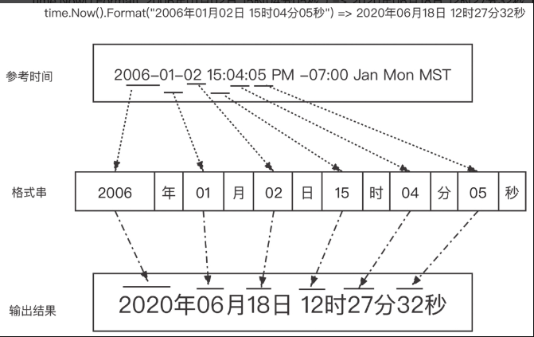

# Time

## 时间的比较与运算

time.Time内包含挂钟时间和单调时间,使用==,!=比较时会同时比较两个时间,会出现在不同时区表示地球上同一时刻的两个Time实例是不相等的情况.
[样例](./compare_and_calc_test.go)

**直接用==和!=来做比较是不适宜的**，这也是time.Time类型不应被用作map类型的key值的原因.

可以使用time.Time的**Equal**方法.

比较方法:

- Equal
- Before
- After

运算方法:

- Sub
- Util

## 格式化

Go文档中给出的标准的参考时间
"2006-01-02 15:04:05 PM -07:00 Jan Mon MST"



## 定时器

- NewTimer
- AfterFunc
- After

都使用Timer,结构如下

```go
// $GOROOT/src/time/sleep.go (go 1.14)
type Timer struct {
    C <-chan Time //接收定时器触发事件的channel
    r runtimeTimer//
}

func NewTimer(d Duration) *Timer {
    c := make(chan Time, 1) // 带一个缓存的channel
    t := &Timer{
        C: c,
        r: runtimeTimer{
            when: when(d),
            f:    sendTime,
            arg:  c,
        },
    }
    startTimer(&t.r)
    return t
}
```

### 一次性定时器

### 定时重复定时器
