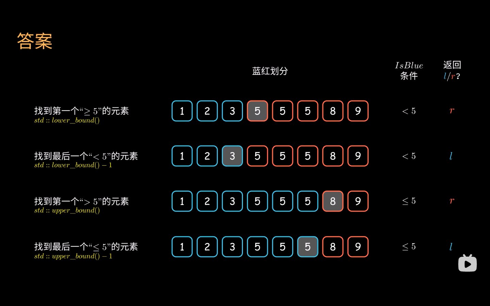

# binary search

- [binary search](#binary-search)
  - [sort.SearchInts使用技巧](#sortsearchints使用技巧)
  - [sort.Search的使用技巧](#sortsearch的使用技巧)
  - [参考](#参考)
    - [蓝红二分](#蓝红二分)

## sort.SearchInts使用技巧

```go
lowerBound := sort.SearchInts
upperBound := func(a []int, x int) int { return sort.SearchInts(a, x+1) }
upperBound = func(a []int, x int) int { return sort.Search(len(a), func(i int) bool { return a[i] > x }) }

```

等于 x 的下标范围：[lowerBound(x), upperBound(x))
lowerBound-1 为 <x 的最大值的下标（-1 表示不存在），存在多个最大值时下标取最大的
upperBound-1 为 <=x 的最大值的下标（-1 表示不存在），存在多个最大值时下标取最大的

## sort.Search的使用技巧

```go
// go.Search注释
// Search uses binary search to find and return the smallest index i
// in [0, n) at which f(i) is true, assuming that on the range [0, n),
// f(i) == true implies f(i+1) == true
// 使用二分查找,返回最小的i使f(i)为true,没有找到为true的i,将返回n

// Note that the "not found" return value is not -1 as in, for instance,
// strings.Index.
// 未找到不返回-1(和strings.Index行为不同)
```

sort.Search(n, f) 需要满足当 x 从小到大时，f(x) 先 false 后 true
若 f(x) 是先 true 后 false，且目标是找到最大的使 f(x) 为 true 的 x
 这种情况可以考虑二分 !f(x)，则二分结果是最小的使 f(x) 为 false 的 x，将其 -1 就得到了最大的使 f(x) 为 true 的 x
 由于要对结果 -1，sort.Search 传入的上界需要 +1
 更加简单的写法是，在 f(x) 内部将 x++，这样就不需要对上界和结果调整 ±1 了

下面以二分求 int(sqrt(90)) 为例来说明这一技巧
 这相当于求最大的满足 x*x<=90 的 x
 于是定义 f(x) 返回 x*x<=90，
 注意这是一个**先 true 后 false 的 f(x)**
 我们可以改为判断 f(x+1)，即用 f(x+1) 的返回结果代替 f(x) 的返回结果
 同时，
 将 f(x) 改为**先 false 后 true**，即返回 x*x>90
 这样二分的结果就恰好停在最大的满足原 f(x) 为 true 的 x 上

```go
sort.Search(10, func(x int) bool {
  x++
  return x*x > 90
})
```

## 参考

- [codeforces-go](https://github.com/EndlessCheng/codeforces-go/blob/master/copypasta/sort.go)
- [二分模板,二分的本质是什么](https://zhuanlan.zhihu.com/p/275995132)
  二分法（dichotomy）指的是将一个整体事物分割成两部分。也即是说，这两部分必须是互补事件，即所有事物必须属于双方中的一方，且互斥，即没有事物可以同时属于双方。
- [蓝红二分法](https://leetcode.cn/problems/find-first-and-last-position-of-element-in-sorted-array/solution/lan-hong-hua-fen-fa-dan-mo-ban-miao-sha-e7r40/)
- [二分模板](https://leetcode.cn/circle/article/xYBtLt/#%C2%A7-%E6%A8%A1%E6%9D%BF%E4%BB%8B%E7%BB%8D)

### 蓝红二分

主体思路：l 指针掌管左边蓝色区域,r 指针掌管右边红色区域，两者互不冲突
通过不断向目标元素靠近扩大掌管区域，直到两者掌管区域接壤，即 l + 1 == r时终止。

开始时，l 指针和 r 指针取在搜索区间界外，l = 首个元素下标 - 1，r = 末尾元素下标，此时所有元素均未着色；
循环条件始终为 l + 1 ≠ r,当 l + 1 == r时跳出循环，此时蓝红区域划分完成，所有元素均已着色；
mid指针取值始终为 mid = floor (l + r) / 2
l 指针和 r 指针变化的时候直接变为 mid指针，即对 mid指针所指向元素进行染色，无需 +1或者 -1；
本模板唯一变化的地方是判断**目标元素最终落在左边蓝色区域还是右边红色区域**。

```go
l,r:=-1,len(v)-1
for l+1<r{
  m:=int(unit(l+r)>>1)
  if isBlue(m)
    l = m
  else
    r = m
}

// 或
l,r:=-1,len(v)-1
for l+1<r{
  m:=int(unit(l+r)>>1)
  if isRed(m)
    r = m
  else
    l = m
}
```

作者：sui-xin-yuan
链接：<https://leetcode.cn/problems/find-first-and-last-position-of-element-in-sorted-aray/solution/lan-hong-hua-fen-fa-dan-mo-ban-miao-sha-e7r40/>
来源：力扣（LeetCode）
著作权归作者所有。商业转载请联系作者获得授权，非商业转载请注明出处。

＜ 、≤ 、≥ 、＞ 目标元素 target 对应的蓝红区域划分

