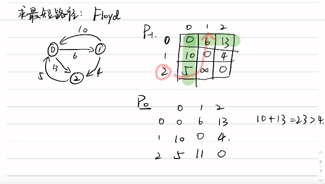

# dp/动态规划

## 覆盖问题

- 55. 跳跃游戏
- 45. 跳跃游戏 II
- 1024. 视频拼接
- 1326. 灌溉花园的最少水龙头数目
- 53. 最大子数组和

## 股票买卖系列

- 121. [买卖股票的最佳时机](https://leetcode.cn/problems/best-time-to-buy-and-sell-stock/solutions/38477/bao-li-mei-ju-dong-tai-gui-hua-chai-fen-si-xiang-b/)
- 122. 买卖股票的最佳时机 II
- 123. 买卖股票的最佳时机 III
- 188. [买卖股票的最佳时机 IV](https://leetcode.cn/problems/best-time-to-buy-and-sell-stock-iv/solutions/2201488/shi-pin-jiao-ni-yi-bu-bu-si-kao-dong-tai-kksg/)
- 309. 最佳买卖股票时机含冷冻
- 714. 买卖股票的最佳时机含手续费

## 求最短路径算法

- 1334. [阈值距离内邻居的数量](https://leetcode-cn.com/problems/number-of-enclaves/solution/38477/)
- 2976. 转换字符串的最小成本 I
- 2977. 转换字符串的最小成本 II

### Floyd算法



```go
// dp[k][i][j]表示经过中间节点K从i到j的最短路径的长度,实际不许存储k份,简化为dp[i][j]


```

## 参考

- [Floyd算法视频讲解](https://www.bilibili.com/video/BV14R4y1x7GB)
